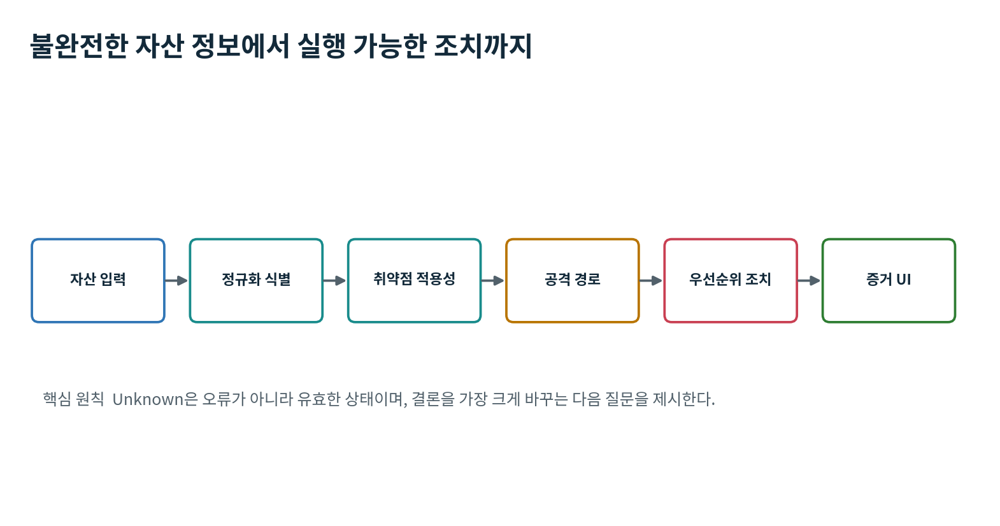
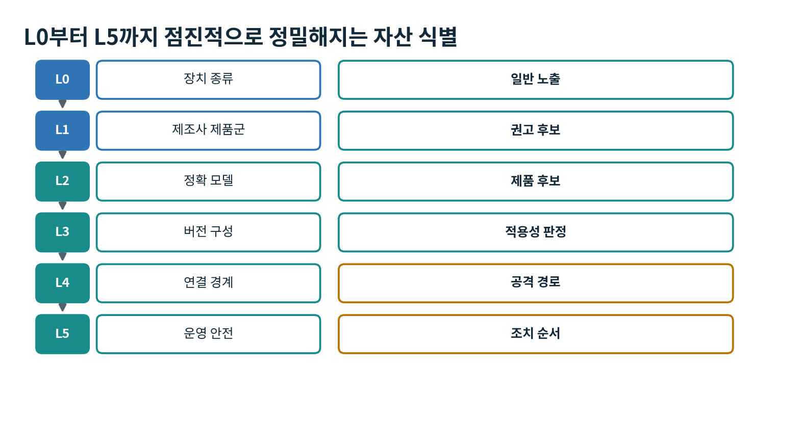
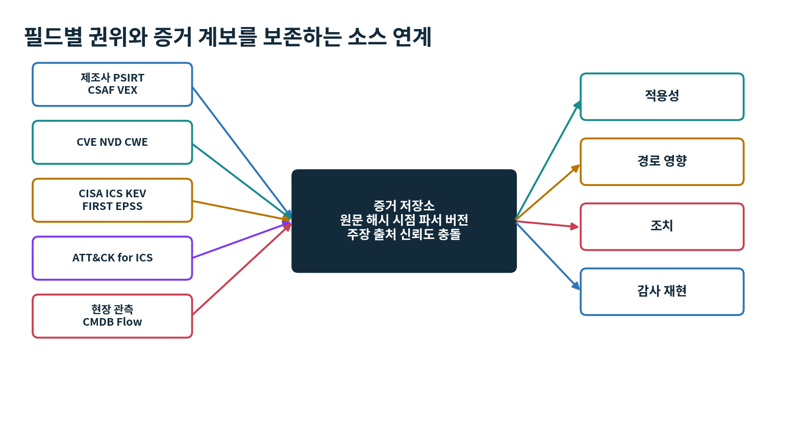
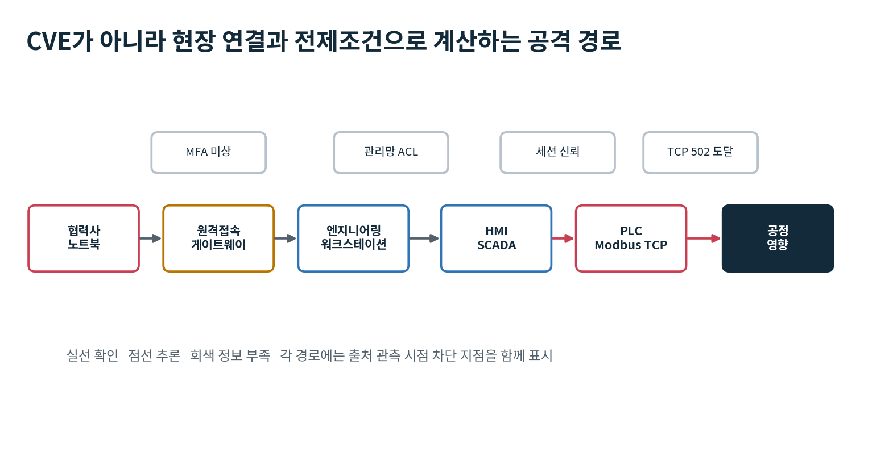
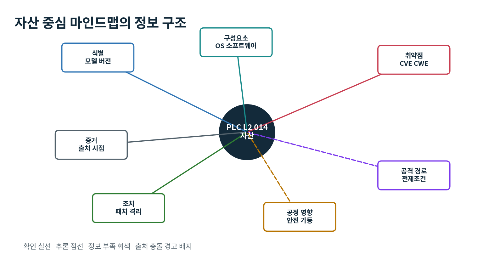
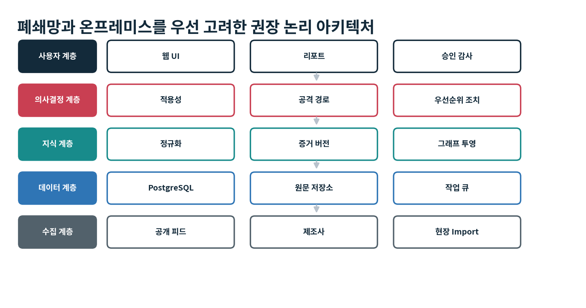

OT ASSET INTELLIGENCE

# 스마트 팩토리 OT 자산 기반 취약점 및 공격 경로 관리 플랫폼

상세 프로젝트 기획서

장치 목록과 불완전한 현장 정보를 입력하면 실제 적용 가능한 취약점과 공격 경로를 증거 수준별로 판별하고, 생산 안전과 정비 여건을 반영한 확인·격리·패치·교체 순서를 제시하는 의사결정 플랫폼의 개발 기준서입니다.

| 항목 | 내용 |
|---|---|
| 문서 목적 | 제품 기획, 데이터 모델, UX, 개발, 시험 및 파일럿의 통합 기준 |
| 버전 | v1.0 |
| 기준일 | 2026-09-09 |
| 대상 독자 | 제품 책임자, OT 보안, 현장 운영, 개발, 데이터, QA |
| 상태 | 프로젝트 착수용 기준선 |

*표 1. 문서 관리 정보*

중요: 이 문서는 패치 실행 명령서가 아닙니다. 모든 현장 변경은 제조사 지침, 사전 시험, 안전 검토, 변경 승인과 롤백 계획을 거쳐야 합니다.

## 문서 사용 방법

이 문서는 아이디어 설명을 넘어서 실제 제품 개발과 파일럿 수행에 필요한 범위, 입력 체계, 데이터 소스, 판정 로직, 사용자 화면, 아키텍처, 요구사항, 시험 기준과 실행 계획을 하나의 기준선으로 묶습니다. 제품의 핵심 산출물은 CVE 목록이 아니라 각 결론의 근거와 다음 행동입니다.



*그림 1. 제품의 입력 판정 조치 가치 흐름*

| 독자 | 먼저 볼 장 | 결정할 내용 |
|---|---|---|
| 제품 책임자 | 1, 3, 4, 11, 17, 22 | 범위, 우선순위, 파일럿 게이트 |
| OT 보안 | 2, 7~11, 18~20 | 적용성, 경로, 조치, 안전 규칙 |
| 현장 운영 | 5, 6, 11, 12, 17 | 입력 가능성, 정비 창, 예외 승인 |
| 개발·데이터 | 7~16, 부록 | 소스, 모델, API, 배치, 보안, 테스트 |
| QA·감사 | 4, 9~11, 16, 18, 19 | 재현성, 근거, 권한, 회귀 |

*표 2. 독자별 사용 지도*

## 목차와 산출물 지도

| 장 | 주제 | 핵심 산출물 |
|---|---|---|
| 1 | 프로젝트 정의 | 문제 목표 비목표 성공 조건 |
| 2 | OT와 Modbus TCP 보안 | 프로토콜 노출 구형 장치 보상 통제 |
| 3 | 사용자와 업무 시나리오 | 페르소나 핵심 사용 사례 |
| 4 | 제품 설계 원칙 | 불확실성 증거 안전 설명 가능성 |
| 5 | 자산 입력 모델 | 장치별 필드 L0~L5 |
| 6 | 정보 부족 대응 | Unknown과 다음 최적 질문 |
| 7 | 다중 데이터 소스 | 권위 수집 충돌 갱신 |
| 8 | 정규 데이터 모델 | 엔터티 주장 버전 계보 |
| 9 | 취약점 적용성 엔진 | 식별 범위 VEX 삼진 논리 |
| 10 | 공격 경로 엔진 | 토폴로지 전제조건 신뢰도 |
| 11 | 우선순위와 조치 | 강제 규칙 P0~P4 OT SSVC |
| 12 | UI UX | 행동 큐 마인드맵 설명 카드 |
| 13 | 기술 아키텍처 | 온프레미스 폐쇄망 구성요소 |
| 14 | API 배치 보안 LLM | 인터페이스 작업 경계 |
| 15 | 기능 요구사항 | 개발 및 인수 기준 |
| 16 | 비기능 요구사항 | 성능 안전 감사 운영성 |
| 17 | MVP 로드맵 인력 | 16주 범위 팀 |
| 18 | 시험과 평가 | 골드셋 정확도 파일럿 |
| 19 | 운영과 거버넌스 | 소스 규칙 예외 수명주기 |
| 20 | 주요 위험과 대응 | 기술 현장 법적 리스크 |
| 21 | 차별화와 확장 | 제품 포지셔닝 단계 |
| 22 | 30일 실행 계획 | 착수 질문 체크리스트 |

## 1 프로젝트 정의

### 1.1 배경과 문제

스마트 팩토리에는 PLC, HMI, 엔지니어링 워크스테이션, SCADA, Historian, DCS, SIS, 로봇, 드라이브, 네트워크 장비와 원격접속 장치가 장기간 공존합니다. 같은 제조사와 제품군이라도 정확한 모델, 주문번호, 하드웨어 리비전, 펌웨어, 옵션 모듈, OS 빌드, 설치 소프트웨어와 네트워크 위치가 다르면 취약점 적용 여부와 공격 경로가 달라집니다.

현장 자산 목록은 대개 완전하지 않습니다. 정확한 버전이 없거나, 장비 스캔이 공정에 영향을 줄 수 있고, 정비 창은 제한적입니다. 따라서 모든 정보를 먼저 요구하거나 CVSS가 높은 순서대로 패치하라는 시스템은 현장에서 사용되지 않습니다.

### 1.2 제품 목표와 성공 조건

| ID | 목표 | 내용 | 측정 |
|---|---|---|---|
| G1 | 정확한 적용성 | 제품·버전·구성·VEX 조건을 근거로 판정 | 골드셋 Precision Recall |
| G2 | 불완전 정보 수용 | L0부터 결과와 다음 질문 제공 | 후보 감소율 완성도 상승 |
| G3 | 현장 맥락 우선순위 | 악용·도달성·공정·안전·정비를 분리 평가 | 전문가 합의 조치 시간 |
| G4 | 설명 가능한 행동 | 결론 근거 출처 시점 대안 통제 제공 | 판정 재현 감사 완전성 |
| G5 | OT 안전성 | 수동·파일·수동 관측 우선, 능동 질의 승인 | 무승인 동작 0건 |
| G6 | 폐쇄망 운영 | 서명된 오프라인 지식 번들 | 갱신 성공률 롤백 검증 |

*표 3. 프로젝트 목표*

### 1.3 비목표

- MVP에서 모든 제조사와 모든 OT 프로토콜을 지원하지 않습니다.
- CVE가 없다는 사실로 안전을 보증하거나 규제 인증을 자동 발급하지 않습니다.
- 운영자 승인 없이 PLC 로직, 펌웨어, 방화벽, 서비스 상태를 변경하지 않습니다.
- LLM이 버전 범위, 적용성, 우선순위 또는 패치 실행 여부를 단독 결정하지 않습니다.
- 기존 CMDB, SIEM, NDR, 티켓 시스템을 전면 대체하지 않습니다.

## 2 OT와 Modbus TCP 보안 배경

### 2.1 프로토콜 노출과 제품 취약점의 구분

전통적인 Modbus TCP는 애플리케이션 계층에서 기밀성, 메시지 무결성, 상호 인증과 세밀한 권한 제어를 기본 제공하지 않습니다. 이는 단일 CVE가 아니라 설계와 배치상의 노출입니다. 반면 패킷 파서 오류, 인증 우회, 웹 관리 결함, 서비스 거부와 같은 문제는 특정 제조사·제품·버전에 귀속되는 CVE입니다. 플랫폼은 두 종류를 별도 객체로 저장하고 공격 경로에서 연결해야 합니다.

| 분류 | 예 | 식별자 | 권장 표현 |
|---|---|---|---|
| 프로토콜 설계 노출 | 평문, 인증 부재, 쓰기 기능 도달 | Exposure Pattern와 관련 CWE | 보안 통제 부재 또는 노출 |
| 제품 구현 취약점 | 파서, 메모리, 인증, 서비스 거부 | CVE와 벤더 권고 | 확정 적용 가능 후보 |
| 구성 취약성 | 과도한 ACL, 기본 계정, 원격관리 노출 | Configuration Finding | 구성 위험 |
| 수명주기 위험 | 지원 종료, 패치 부재, 인증서 운영 불가 | Lifecycle Finding | 교체 또는 격리 검토 |

*표 4. OT에서 분리해야 할 위험 객체*

### 2.2 Modbus Security와 구형 PLC

Modbus Security는 기존 Modbus 메시지를 TLS로 보호하고 X.509 인증서를 이용한 상호 인증과 역할 정보를 지원합니다. 전통적인 Modbus TCP는 일반적으로 TCP 502, Modbus Security는 TCP 802를 사용합니다. 그러나 구형 PLC에는 TLS 스택, 인증서·키 저장소, 난수원, 안전한 시간, 암호 연산 자원과 검증된 펌웨어 업데이트 경로가 없을 수 있습니다. 제조사가 해당 하드웨어용 펌웨어를 제공하지 않으면 네트워크 설정만으로 직접 기능을 추가할 수 없습니다.

### 2.3 구형 장치의 보상 통제

| 통제 | 효과 | 한계와 검증 |
|---|---|---|
| 프로토콜 인지 방화벽 ACL | 허용 IP 방향 기능코드 쓰기 축소 | 오탐 차단의 공정 영향 시험 |
| 보안 게이트웨이 mTLS 터널 | 구간 간 인증 암호화 무결성 | 게이트웨이 이후 PLC 마지막 구간은 평문 가능 |
| 망분리 Zone Conduit | 업무망에서 TCP 502 직접 도달 차단 | 우회 연결과 승인된 관리 경로 관리 |
| 점프 서버 MFA 세션 기록 | 관리 접점 축소와 사용자 추적 | 공용 계정과 우회 원격접속 제거 |
| 수동 IDS 기준선 | 비정상 쓰기와 새 통신 상대 탐지 | 탐지 후 대응 절차 필요 |
| 읽기 쓰기 분리 | 불필요한 제어 기능 최소화 | 장치·게이트웨이 기능코드 정책 필요 |
| 교체 계획 | 지원 종료와 암호 기능 부재의 근본 해소 | 생산 중단 재인증 예비품 계획 |

## 3 사용자와 업무 시나리오

| 역할 | 핵심 질문 | 주요 화면 | 권한 |
|---|---|---|---|
| OT 보안 분석가 | 어떤 자산이 실제 영향 대상이며 경로가 있는가 | 적용성 증거 공격 경로 | 판정 검토 근거 추가 |
| 현장 운영 제어 엔지니어 | 공정 중단 없이 무엇을 언제 해야 하는가 | 행동 큐 정비 창 대안 통제 | 현장 정보 완료 증거 |
| 자산 관리자 | 빠진 모델과 버전을 어떻게 보완하는가 | 자산 품질 다음 질문 | 등록 수정 Import |
| CISO 공장장 | 상위 위험과 미해결 이유 추세는 무엇인가 | 요약 리스크 SLA | 읽기 예외 승인 |
| 감사 품질 | 당시 어떤 근거로 무엇을 결정했는가 | 결정 스냅샷 변경 이력 | 읽기 보고서 |
| 플랫폼 관리자 | 소스 규칙 번들이 정상인가 | 운영 콘솔 | 관리 배포 |

*표 5. 사용자 페르소나*

### 3.1 핵심 사용 사례

| ID | 업무 | 완료 조건 |
|---|---|---|
| UC01 | 초기 자산 등록 | CSV 또는 수동으로 L0~L2 자산을 만들고 후보와 다음 질문을 받음 |
| UC02 | 정보 보강 | 명판 OCR, 프로젝트 파일, 수동 PCAP, 승인 질의 결과를 증거로 추가 |
| UC03 | 신규 권고 영향 분석 | 새 권고 유입 시 대상 자산의 판정 변화를 재계산 |
| UC04 | 공격 경로 조사 | 원격 접점에서 중요 공정까지 확인 추론 미상 경로 비교 |
| UC05 | 조치 계획 | P0~P4, 담당자, 기한, 정비 창, 임시 통제, 롤백 생성 |
| UC06 | 패치 불가 대응 | 벤더 미지원 EOL 자산에 격리 모니터링 교체 계획 연결 |
| UC07 | 예외 승인 | 연기 또는 위험 수용의 사유 승인자 만료 통제 기록 |
| UC08 | 감사 재현 | 과거 시점의 소스 규칙 입력으로 동일 판정 재현 |

*표 6. 핵심 사용 사례*

## 4 제품 설계 원칙

| ID | 원칙 | 설계 적용 |
|---|---|---|
| P1 | 불확실성 우선 | Unknown Likely Conflict Stale를 유효 상태로 관리하고 확정과 추론을 섞지 않음 |
| P2 | 증거 중심 | 출처 관측 시점 유효기간 원문 해시 파서와 규칙 버전 보존 |
| P3 | 현장 안전 | 수동 수집과 파일 분석 우선, 능동 질의와 변경은 명시 승인 |
| P4 | 필드별 권위 | 제품 영향은 벤더, 악용은 KEV, 도달성은 현장 증거를 우선 |
| P5 | 결정과 정렬 분리 | 강제 안전 규칙을 보호하고 사용자 렌즈는 같은 버킷 안의 순서만 변경 |
| P6 | 설명 가능 | 점수보다 결론을 바꾼 조건과 누락 정보와 대안 조치를 먼저 제시 |
| P7 | 시간 축 | 모든 결론을 as of 시점과 함께 저장하여 과거 판정 재현 |
| P8 | 폐쇄망 우선 | 서명 번들, 로컬 판정, 온라인 의존 최소화 |
| P9 | 상호운용 | CSAF VEX CVE CPE PURL STIX OVAL CSV JSON API를 경계 형식으로 사용 |
| P10 | 사람 승인 | 패치 격리 재시작 정책 예외는 권한 있는 사람이 승인 |

*표 7. 제품 설계 원칙*

## 5 자산 입력 모델

입력 단위는 장치 한 줄이 아니라 Factory, Site 또는 Area, Zone 또는 Cell, Asset, Component, Installed Product 계층입니다. HMI 안의 OS, 런타임, 웹 서버, DB와 PLC 랙의 CPU, 통신 모듈, 펌웨어를 분리해야 서로 다른 권고문과 CVE를 정확히 연결할 수 있습니다.



*그림 2. L0부터 L5까지의 점진 입력과 결과*

| 단계 | 최소 입력 | 제공 가능한 결과 | 확신도 |
|---|---|---|---|
| L0 | 장치 종류 수량 위치 | 일반 노출 필수 통제 데이터 부족 | 낮음 |
| L1 | 제조사 제품군 | 권고 후보와 제조사별 다음 질문 | 낮음~중간 |
| L2 | 정확 모델 주문번호 SKU | 제품 일치 후보 | 중간 |
| L3 | 펌웨어 OS 애플리케이션 버전 | 적용성 확정 가능 비해당 | 중간~높음 |
| L4 | Zone 통신 원격접속 신뢰 | 공격 경로와 차단 후보 | 높음 |
| L5 | 공정 안전 정비 복구 | 조치 버킷 순서 실행 계획 | 높음 |

*표 8. 점진 입력 단계*

### 5.1 장치 종류별 우선 필드

| 장치 | 우선 필드 | 보강 필드 |
|---|---|---|
| PLC PAC RTU | 제조사 Family 모델 주문번호 HW Rev 펌웨어 | 랙 슬롯 통신 모듈 Bootloader 프로젝트 실행 모드 |
| HMI SCADA | 장치 또는 서버 모델 OS Edition Build 런타임 제품 버전 | 웹 DB Java NET 드라이버 패치 원격접속 SW |
| Engineering WS | OS Build IDE Engineering Suite 버전 | 프로젝트 파일 드라이버 관리자 도구 이동식 매체 정책 |
| Historian | OS DB Historian 제품 버전 | 커넥터 웹 포털 서비스 계정 백업 외부 BI |
| DCS SIS Safety PLC | 시스템 컨트롤러 버전 HW Rev 도구 | 중복 구성 안전 기능 인증 영향 유지보수 상태 |
| 네트워크 VPN | 제조사 모델 OS 펌웨어 구성 버전 | 관리 인터페이스 인증 Zone ACL VPN MFA EOL |
| IIoT Edge | HW OS Kernel Runtime Agent Container | 패키지 SBOM 인증서 클라우드 엔드포인트 업데이트 채널 |
| 로봇 드라이브 센서 | 제조사 모델 펌웨어 옵션 모듈 | Teach Pendant Engineering SW Fieldbus 안전 옵션 |

*표 9. 장치군별 입력 필드*

## 6 정보 부족 대응과 다음 최적 질문

### 6.1 Unknown을 정상 상태로 취급

| 상태 | 의미 | 기본 행동 |
|---|---|---|
| affected_confirmed | 제품 버전 구성 조건이 현장 증거와 일치 | 조치 결정 진행 |
| affected_likely | 제품은 강하게 일치하나 일부 버전 또는 조건 추론 | 보상 통제와 확인 질문 |
| candidate | 제품군 또는 별칭 수준 후보 | 식별 정보 추가 |
| insufficient_information | 판정에 필요한 핵심 값 없음 | 다음 최적 질문 |
| not_affected_confirmed | 벤더 VEX 버전 조건으로 비영향 확인 | 근거와 유효 시점 보존 |
| fixed | 수정 버전 패치와 설치 증거 확인 | 회귀 상태 모니터 |
| conflicting_evidence | 출처 또는 현장 관측이 상충 | 사람 검토와 결론 보류 |
| stale | 관측 또는 권고가 정책상 너무 오래됨 | 재수집 |
| no_known_match | 현재 범위에서 알려진 일치 없음 | 안전 표현 금지 |

*표 10. 적용성 및 정보 상태*

### 6.2 다음 최적 질문 알고리즘

질문 순서는 고정 폼이 아니라 후보 감소량, 조치 버킷 변경 확률, 수집 비용, 공정 위험과 접근 가능성을 사용해 계산합니다. 예를 들어 주문번호가 후보 120개를 8개로 줄이고 펌웨어는 8개를 2개로 줄이면 주문번호를 먼저 묻습니다. 반대로 모델이 확정되고 특정 권고의 경계 버전만 남았다면 펌웨어가 첫 질문입니다.

| 질문 카드 요소 | 예 |
|---|---|
| 무엇 | CPU 주문번호와 펌웨어 버전을 확인해 주세요 |
| 왜 | 현재 후보 37개 중 29개를 제외하고 조치 등급이 달라질 수 있습니다 |
| 어디서 | 명판, 진단 웹, 엔지니어링 프로젝트의 Device Properties |
| 허용 증거 | 직접 관측, 서명 내보내기, 화면 사진 OCR, 담당자 입력 |
| 모를 때 | 확인 불가를 선택하면 후보를 유지하고 임시 통제를 제시 |

*표 11. 다음 질문 UI 필수 설명*

### 6.3 안전한 수집 우선순위

| 순서 | 방법 | 공정 위험 | 주의 |
|---|---|---|---|
| 1 | 기존 CMDB CSV 도면 | 매우 낮음 | 형식 불일치와 오래된 값 |
| 2 | 명판 사진 OCR | 낮음 | 촬영 승인 오인식 원본 병기 |
| 3 | 엔지니어링 프로젝트 백업 | 낮음 | 파일 버전과 실제 배포 상태 차이 |
| 4 | 수동 PCAP 미러 포트 | 낮음 | 관측되지 않은 자산과 암호화 구간 |
| 5 | 운영자 승인 Safe Query | 중간 | 벤더 안전 프로필과 정비 승인 |
| 6 | 일반 능동 스캔 | 높음 | MVP 기본 금지 시험망 검증 후 예외 |

*표 12. 자산 정보 수집 우선순위*

## 7 다중 데이터 소스 연계



*그림 3. 필드별 권위와 증거 기반 결론*

| 판정 필드 | 우선 소스 | 보조 소스 | 사용 원칙 |
|---|---|---|---|
| 제품 영향 수정 범위 | 제조사 PSIRT CSAF VEX | CISA ICS 권고 CNA | 모델 버전 상태 완화책의 1차 근거 |
| CVE 기본 기록 | CVE CNA Record | NVD | ID 설명 참조 CVSS CWE 보강 |
| 제품 식별 | 제조사 카탈로그 프로젝트 파일 | CPE PURL 현장 관측 | 별칭과 주문번호 구성요소 매핑 |
| 실제 악용 | CISA KEV | 벤더 정부 경보 | 강제 상황 신호 |
| 향후 악용 가능성 | FIRST EPSS | 내부 위협정보 | 정렬 보조 OT 특화 확률로 오인 금지 |
| 공격 기법 | MITRE ATT&CK for ICS | 검토된 내부 매핑 | 기법 분류와 탐지 완화 참조 |
| 도달성 공정 영향 | 현장 네트워크 운영 증거 | 도면 인터뷰 | 외부 소스로 대체 불가 |
| 수명주기 | 제조사 EOL EOS | 계약 현장 기록 | 패치 가능성과 교체 판단 |

*표 13. 필드별 소스 권위*

### 7.1 수집 커넥터와 갱신

| 소스 | 형식 | 주기 | 커넥터 주의 |
|---|---|---|---|
| CVE Program | CVE JSON 5 | 일 또는 증분 | Record 변경과 상태 추적 |
| NVD | REST API JSON | 일 또는 증분 | Rate limit 수정 시각 |
| CISA KEV | JSON CSV | 일 | 신규 삭제 기록 수정 버전 보존 |
| CISA ICS | HTML 피드 수동 | 일 | 구조 변동 대비 원문 저장 |
| FIRST EPSS | CSV API | 일 | score percentile 시계열 |
| CSAF VEX | JSON 2.0 | 공급자 주기 | 서명 해시 Profile Product Tree 검증 |
| ATT&CK ICS | STIX TAXII JSON | 릴리스 | 버전 고정 폐기 항목 유지 |
| OS 벤더 | OVAL API CSAF | 일 | 패키지 epoch revision 규칙 |
| 현장 | CSV JSON PCAP 프로젝트 | 수동 배치 | 원문 암호화 파서 승인 |

*표 14. 우선 커넥터 설계*

### 7.2 충돌과 갱신 정책

- 새 값으로 기존 값을 덮어쓰지 않고 assertion을 추가합니다. 화면의 현재 값은 권위, 시점, 확신도 규칙으로 계산한 뷰입니다.
- published_at, modified_at, ingested_at, observed_at, valid_until을 구분합니다.
- 벤더와 NVD의 영향 범위가 다르면 벤더를 기본 결론으로 사용하되 충돌 배지와 두 원문을 보존합니다.
- 원문은 콘텐츠 해시와 함께 불변 저장하고 파싱 결과는 parser_version으로 재생성할 수 있어야 합니다.
- 수집 실패를 새 정보 없음으로 표시하지 않고 커넥터 상태와 오류를 운영 화면에 노출합니다.

## 8 정규 데이터 모델과 지식 그래프

| 엔터티 | 역할 | 대표 필드 |
|---|---|---|
| factory site zone | 물리 논리 위치와 보안 경계 | id name criticality parent_id |
| asset | 현장 장치 서버 네트워크 노드 | asset_type owner lifecycle criticality |
| component | CPU 통신 모듈 OS 앱 DB | component_type slot path asset_id |
| product | 정규 제조사 제품 에디션 버전 | vendor family model identifiers version |
| observation | 자산 값의 관측 입력 증거 | field value method observed_at confidence |
| vulnerability | CVE 중심 취약점 개체 | cve_id descriptions cwe cvss dates |
| advisory | 벤더 기관 권고문 | publisher advisory_id revision url raw_hash |
| product_status | affected fixed not_affected | product_id vuln_id status conditions |
| version_range | 영향 수정 범위 | scheme lower upper inclusive raw_expression |
| exposure | 프로토콜 구성 수명주기 노출 | pattern_id condition evidence |
| topology_edge | 통신 신뢰 관리 의존 관계 | from to type direction protocol evidence |
| decision | 시점별 적용성 조치 결론 | as_of rule_version input_hash rationale |
| recommendation | 패치 격리 확인 교체 행동 | bucket owner due prerequisites rollback |
| assertion | 출처가 주장한 원자 사실 | subject predicate object source validity |

*표 15. 정규 데이터 모델*

### 8.1 증거와 계보

| 차원 | 질문 | 대표 근거 |
|---|---|---|
| Identity | 이 자산이 정확히 어떤 제품인가 | 주문번호 명판 프로젝트 프로토콜 배너 |
| Applicability | CVE 조건과 실제 버전 구성이 일치하는가 | CSAF VEX 버전 모듈 기능 상태 |
| Path | 공격자가 경로와 전제조건을 만족하는가 | Flow ACL 원격접속 계정 신뢰 |
| Action | 조치가 이 현장에서 실행 가능하고 안전한가 | 벤더 절차 시험 정비 창 롤백 |

*표 16. 분리해야 할 확신도*

### 8.2 버전 표현

- 원문 표현 raw_expression을 반드시 보존하고 정규화 표현은 별도 저장합니다.
- SemVer만 가정하지 않고 펌웨어 리비전, OS 빌드, RPM DEB epoch, 핫픽스를 scheme별 비교기로 처리합니다.
- 버전 미상을 0으로 치환하지 않으며 비교 불가 시 정보 부족 또는 적용 가능성 높음으로 남깁니다.
- 펌웨어와 하드웨어 리비전, 앱과 OS가 함께 조건이면 조건식 트리로 표현합니다.

## 9 취약점 적용성 엔진

| 단계 | 처리 | 핵심 로직 | 산출물 |
|---|---|---|---|
| 1 | 정규화 | 제조사 제품 별칭 모델 버전 OS 표기 정리 | 정규화 값과 원문 |
| 2 | 엔터티 식별 | 정확 식별자 다음 규칙 사전 다음 퍼지 후보 | product 후보와 근거 |
| 3 | 후보 검색 | CSAF Product Tree CPE 구성 벤더 권고 | CVE 권고 후보 |
| 4 | 범위 평가 | 제품 버전 HW 모듈 기능 OS 조건식 | true false unknown |
| 5 | VEX 상태 | known affected fixed not affected investigation | 공급자 상태 |
| 6 | 충돌 처리 | 소스 권위 시점 상충 주장 | 결론 또는 검토 큐 |
| 7 | 설명 생성 | 일치 불일치 누락 필드 출처 | 판정 카드 |

*표 17. 적용성 엔진 파이프라인*

### 9.1 식별 수준과 자동화 정책

| 수준 | 증거 | 정체성 확신 | 정책 |
|---|---|---|---|
| Exact | 제품 UUID 주문번호 SKU PURL 서명 프로젝트 ID | 매우 높음 | 자동 연결 가능 |
| Deterministic | 제조사 모델 리비전 정규식 벤더 사전 | 높음 | 충돌 없을 때 자동 |
| Composite | 제조사 제품군 프로토콜 펌웨어 배너 | 중간 | 후보 1개여도 likely |
| Fuzzy | OCR 자유 텍스트 유사도 | 낮음~중간 | 사람 확인 필수 |
| Inferred | 네트워크 행위 피어 프로젝트 관계 | 낮음 | 후보 제시만 |

*표 18. 제품 엔터티 식별 수준*

### 9.2 판정 규칙

조건식은 true, false, unknown의 삼진 논리로 평가합니다. 제품과 버전이 일치해도 옵션 모듈 설치가 영향 조건인데 모듈 정보가 없으면 affected_confirmed가 아니라 affected_likely 또는 insufficient_information입니다. not affected는 벤더 상태나 명시 조건 불일치 근거가 있을 때만 확정합니다.

| 제품 | 버전 | 구성 | VEX | 출력 |
|---|---|---|---|---|
| 일치 | 영향 범위 | 충족 | Known affected | affected_confirmed |
| 일치 | 미상 | 충족 또는 미상 | 없음 | affected_likely 또는 insufficient_information |
| 후보 | 미상 | 미상 | 없음 | candidate |
| 일치 | 영향 범위 밖 | 무관 | 없음 | not_affected_confirmed |
| 일치 | 영향 가능 | 미상 | Not affected와 근거 | not_affected_confirmed |
| 일치 | 수정 버전 | 패치 증거 | Fixed | fixed |
| 상충 | 상충 | 상충 | 상충 | conflicting_evidence |

*표 19. 적용성 판정 예*

## 10 공격 경로 엔진



*그림 4. 현장 전제조건과 증거를 포함한 공격 경로 예*

| 범주 | 필요 정보 | 증거 |
|---|---|---|
| 노드 | 외부 접점 사용자 점프 서버 WS HMI PLC SIS DB 클라우드 | 자산 Zone 계정 서비스 |
| 통신 | 방향 포트 프로토콜 피어 세션 | PCAP Flow 방화벽 도면 |
| 신뢰 | 공용 계정 도메인 원격관리 프로젝트 다운로드 인증서 | 설정 인터뷰 로그 |
| 취약점 전제 | 네트워크 또는 로컬 인증 권한 상호작용 기능 활성 | CVE 벤더 권고 |
| 공정 관계 | HMI PLC가 어떤 셀 액추에이터 안전 기능을 제어 | P and ID IO 목록 프로젝트 |
| 통제 | ACL MFA 일방향 게이트웨이 모니터링 | 정책 실측 |

*표 20. 공격 경로 계산 입력*

### 10.1 그래프 관계와 신뢰도

| 관계 | 의미 | 필수 속성 |
|---|---|---|
| can_reach | 네트워크 도달 | 방향 포트 프로토콜 ACL last_seen |
| administers | 관리 또는 다운로드 | 도구 계정 MFA 승인 |
| trusts | 인증 도메인 인증서 신뢰 | 주체 범위 강도 |
| controls | 논리 물리 공정 제어 | 태그 IO 셀 안전 영향 |
| depends_on | 서비스 데이터 시간 라이선스 의존 | 가용성 영향 |
| has_vulnerability | 적용성 판정 연결 | status confidence as_of |
| has_exposure | 프로토콜 구성 노출 | 조건 보상 통제 |

*표 21. 경로 그래프 관계*

- 단순 최단 경로가 아니라 각 취약점의 전제조건을 상태 전이로 평가합니다.
- 확인된 통신은 실선, 규칙 추론은 점선, 정보 부족은 회색으로 표시하고 추론 경로를 자동으로 확정하지 않습니다.
- 경로 확신도는 가장 약한 핵심 엣지와 증거 신선도를 반영합니다.
- 차단 지점은 외부 VPN MFA, 점프 서버 ACL, HMI에서 PLC 쓰기 제한처럼 공정 영향이 낮은 후보를 비교합니다.
- ATT&CK for ICS는 기법 분류와 탐지 완화 참조에 사용하고 CVE에서 기법으로의 연결은 출처가 있는 매핑과 내부 추론을 구분합니다.

## 11 우선순위와 조치 결정 엔진

| 차원 | 신호 | 역할 |
|---|---|---|
| 기술 심각도 | CVSS v4 Base Environmental 영향 전제조건 | 기술 영향 |
| 실제 악용 | CISA KEV와 벤더 기관 확인 | 강제 상황 |
| 악용 가능성 | EPSS score percentile 공개 익스플로잇 | 정렬 보조 |
| 적용성 | 제품 버전 구성 VEX 상태 | 판정 게이트 |
| 도달성 | 현장 경로 인증 권한 경계 통제 | 현장 노출 |
| 공정 안전 | 생산 중단 품질 환경 인명 안전 기능 | 최대 영향 |
| 자산 중요도 | 병목 대체 가능성 복구 시간 라인 의존 | 사업 영향 |
| 수명주기 | EOL EOS 패치 예비품 지원 계약 | 장기 대응 |
| 정비 가능성 | 시험 환경 정비 창 재시작 롤백 | 실행 순서 |
| 정보 부족 | 정체성 버전 경로 조치 확신 | 확인 작업 긴급도 |

*표 22. 우선순위 평가 신호*

### 11.1 강제 상황 규칙

| 규칙 | 조건 | 결정 | 보호 장치 |
|---|---|---|---|
| H01 | KEV와 적용 확정 또는 가능 그리고 유효 경로 | 최소 P1, 안전 영향 크면 P0 검토 | 사용자 가중치로 하향 불가 |
| H02 | 무인증 원격 쓰기 또는 로직 변경이 중요 자산에 도달 | P0 격리와 현장 비상 검토 | 패치 전 경로 차단 가능 |
| H03 | 벤더 Critical과 공정 안전 영향과 외부 상위 Zone 도달 | P1 비정기 정비 또는 즉시 완화 | 회귀 시험과 롤백 |
| H04 | EOL 원격접속 경계 자산과 버전 미상 | P1 확인 격리 교체 계획 | 무조건 패치 표현 금지 |
| H05 | 소스 충돌과 높은 잠재 안전 영향 | P1 검토 큐 | 결론 보류 보수 통제 |

*표 23. 초기 강제 상황 규칙*

### 11.2 행동 버킷

| 버킷 | 의미 | 대표 조건 | 필수 산출물 |
|---|---|---|---|
| P0 | 지금 격리 또는 비상 검토 | 활성 악용 또는 직접 제어 안전 경로 | 현장 책임자 호출 영향 최소 격리 증거 보존 벤더 연락 |
| P1 | 정기 창 밖 조치 | 높은 영향 도달성 KEV EOL 경계 | 임시 통제 즉시 가속 시험 패치 또는 교체 승인 |
| P2 | 다음 정비 창 | 적용 확인 통제 존재 단기 악용 제한 | 시험 백업 롤백 포함 작업 패키지 |
| P3 | 확인 또는 모니터 | 후보 정보 부족 낮은 도달성 | 다음 질문 수동 모니터링 소스 갱신 |
| P4 | 비해당 수용 종결 | 비영향 수정 확인 또는 승인 위험 수용 | 근거 승인 만료 재평가 트리거 |

*표 24. P0부터 P4 행동 버킷*

### 11.3 사용자 렌즈와 OT SSVC

사용자가 안전, 악용, 도달성, 기술, 수명, 정비 가중치를 조정하면 같은 행동 버킷 안의 정렬과 설명 순서가 바뀝니다. 강제 상황 규칙과 안전 하한은 렌즈 적용 후에도 숨기거나 하향할 수 없습니다. SSVC의 의사결정 트리 사고방식을 차용해 exploitation, reachability 또는 automatable, technical impact, mission 또는 safety impact, mitigation status를 명시적으로 평가하고 내부 프로파일과 승인자를 버전 관리합니다.

## 12 UI UX 상세 설계

### 12.1 화면 구조

| 화면 | 핵심 내용 | UX 요구 |
|---|---|---|
| 온보딩 가져오기 | 공장 Zone 자산 CSV 매핑 L0 시작 | 필수값 최소화 미상 허용 미리보기 되돌리기 |
| 행동 큐 | P0~P4 담당자 기한 정비 창 상태 | 기본 홈 위험 점수보다 해야 할 일 |
| 자산 목록 | 식별 완성도 노출 취약점 경로 EOL | 필터 저장 보기 대량 편집 증거 신선도 |
| 자산 상세 | 정체성 구성요소 취약점 통신 조치 이력 | 값 옆 출처 시점 확신 |
| 취약점 상세 | 적용성 CVSS KEV EPSS 영향 수정 완화 | 일치 조건과 불일치 누락 필드를 표로 설명 |
| 마인드맵 | 자산 중심 식별 CVE CWE 경로 영향 조치 증거 | 탐색용 실선 점선 회색 의미 고정 |
| 공격 경로 | 진입점에서 공정 영향 차단 후보 | 전제조건 확신 관측 시점 가상 차단 비교 |
| 증거 비교 | 벤더 NVD 현장 주장과 충돌 | 사용자가 근거를 채택 또는 보류하고 결론은 규칙 재계산 |
| 정책 렌즈 | 가중치 강제 규칙 미리보기 | 변경 전후 순위와 보호 규칙 표시 |
| 운영 콘솔 | 커넥터 번들 파서 규칙 작업 큐 | 마지막 성공 오류 지연 서명 검증 |

*표 25. 주요 화면 요구사항*



*그림 5. 자산 중심 마인드맵과 표시 규칙*

### 12.2 취약점 카드 정보 우선순위

| 순서 | 요소 | 표시 내용 |
|---|---|---|
| 1 | 적용성 배지 | 확정 가능 후보 정보 부족 비해당과 확신 이유 |
| 2 | 권장 행동 | P0~P4 담당 목표일 정비 창 임시 통제 |
| 3 | 결론 이유 | KEV 도달성 안전 EOL 등 상위 조건 |
| 4 | 일치 조건 | 제품 모델 버전 구성의 일치 불일치 미상 |
| 5 | 외부 신호 | CVSS 벡터 KEV EPSS 시점 벤더 심각도 |
| 6 | 근거 | 벤더 권고 CISA 현장 관측 원문 링크 해시 |
| 7 | 이력 | 판정 렌즈 규칙 예외 완료 증거 변화 |

*표 26. 취약점 상세 카드의 정보 계층*

## 13 기술 아키텍처



*그림 6. 권장 논리 아키텍처*

| 구성요소 | 책임 | 초기 구현 후보 |
|---|---|---|
| Web UI | 자산 행동 큐 마인드맵 경로 정책 | React TypeScript Cytoscape.js |
| API Gateway | 인증 권한 요청 제한 감사 상관 ID | Nginx 또는 Envoy와 OIDC |
| Application API | 업무 API 승인 보고서 | FastAPI 또는 Spring Boot |
| Ingestion | 외부 현장 커넥터 스키마 원문 저장 | Python Worker와 Scheduler |
| Normalization | 별칭 제품 버전 CPE PURL 매핑 | 규칙 엔진과 사전 |
| Applicability | 삼진 논리 조건식 VEX 버전 평가 | 결정적 규칙 모듈 |
| Path Engine | 그래프 투영 전제조건 경로 차단 후보 | PostgreSQL 기반 선택적 Neo4j |
| Priority Engine | 강제 규칙 OT SSVC 렌즈 설명 | 버전 관리 규칙 DSL |
| PostgreSQL | 정규 업무 증거 결정 감사 데이터 | JSONB 파티셔닝 |
| Object Store | 원문 권고 Import 프로젝트 보고서 | MinIO 또는 S3 호환 |
| Queue Cache | 수집 재계산 작업 짧은 캐시 | Redis RabbitMQ |
| Observability | 로그 메트릭 추적 커넥터 상태 | OpenTelemetry |

*표 27. 권장 기술 구성요소*

### 13.1 배포 모드

| 모드 | 위치 | 데이터 흐름 | 우선순위 |
|---|---|---|---|
| 온프레미스 연결형 | OT DMZ 또는 관리망 제한적 outbound | 온라인 피드 동기화와 로컬 현장 데이터 | 기본 권장 |
| 완전 폐쇄망 | 인터넷 없음 | 외부에서 서명 번들 생성 반입 검증 | 핵심 요구 |
| 중앙 공장 노드 | 본사와 다수 공장 | 중앙 지식과 공장별 민감 데이터 경로 | Phase 2 |
| SaaS | 클라우드 | 테넌트 격리 국외 반출 연동 보안 | 요건 확정 후 |

*표 28. 배포 모드*

## 14 API 배치 보안과 LLM 경계

| API | 목적 | 핵심 입력 | 출력 |
|---|---|---|---|
| POST /assets/import | CSV JSON 대량 등록 | dry_run mapping idempotency_key | job id와 오류 행 |
| POST /assets | 자산 구성요소 등록 | identity location observations | asset id와 질문 |
| POST /assets/{id}/observations | 증거 값 추가 | field value method observed_at | 현재 값 변화 |
| GET /assets/{id}/findings | 적용 취약점과 노출 | as_of status lens | 판정 근거 |
| GET /vulnerabilities/{id} | 통합 취약점 보기 | source_revision | 권고 상태 충돌 |
| GET /graphs/attack-paths | 경로 검색 | source target confidence | 경로 전제 차단 |
| POST /decisions/preview | 렌즈 규칙 변경 미리보기 | policy_version weights | 순위 버킷 변화 |
| GET /actions | 행동 큐 | bucket owner due zone | 작업 목록 |
| POST /actions/{id}/approve | 예외 패치 격리 승인 | reason window rollback | 승인 이벤트 |
| GET /evidence/{id} | 원문 계보 조회 | redaction_policy | 메타데이터 허용 원문 |

*표 29. 초기 REST API*

### 14.1 배치와 이벤트

| 작업 | 역할 | 트리거 | 산출물 |
|---|---|---|---|
| source.fetch | 피드 다운로드 서명 해시 확인 | 소스 주기 | 원문 스냅샷 |
| source.parse | 스키마 검증 주장 생성 | 새 스냅샷 | assertion 후보 |
| normalize.product | 제품 버전 별칭 정규화 | 주장 관측 변경 | product 후보 |
| match.recompute | 영향 자산 재판정 | 권고 자산 변경 | decision |
| path.recompute | 관련 그래프 경로 재계산 | 토폴로지 판정 변경 | attack_path |
| priority.recompute | 버킷 렌즈 조치 갱신 | 정책 경로 결정 변경 | action |
| freshness.check | 오래된 관측 소스 알림 | 매일 | stale task |
| bundle.export import | 폐쇄망 지식 전달 | 승인 요청 | 서명 번들 적용 보고 |

*표 30. 주요 비동기 작업*

### 14.2 플랫폼 보안

| 영역 | 통제 |
|---|---|
| 인증 권한 | OIDC 또는 SAML, MFA, 공장 Zone 범위 RBAC, 최소 권한 |
| 암호화 | 전송 저장 백업 암호화, 별도 키 관리와 회전 |
| 비밀 | Vault 또는 KMS, 소스 API 키 외부 보관, 로그와 코드 노출 금지 |
| 데이터 무결성 | 피드 서명 해시, 원문 불변, 파서 샌드박스, 스키마 제한 |
| 감사 | 로그인 조회 내보내기 판정 규칙 승인 삭제 이벤트 |
| 업로드 | 파일 유형 크기 압축폭탄 경로순회 악성코드 검사 |
| 네트워크 | 수집기 서버 DB 분리, OT 셀 직접 outbound 금지, DMZ 중계 |
| 가용성 | 작업 큐 격리 요청 제한 백업 복구 읽기 전용 비상 모드 |
| 공급망 | SBOM 고정 의존성 서명 빌드 SAST DAST 비밀 검사 |

*표 31. 제품 자체 보안 기준*

### 14.3 LLM 사용 경계

| 구분 | 정책 |
|---|---|
| 허용 | 권고문 한국어 요약, 필드 추출 초안, 제품 별칭 후보, 다음 질문 문구, 사용자 설명 초안 |
| 검토 필요 | 비정형 벤더 PDF의 영향 범위 추출은 스테이징 저장 후 사람 또는 규칙 검증 |
| 금지 | 버전 비교, affected 또는 not affected 확정, P0~P4 단독 결정, 패치나 PLC 쓰기 실행 |
| 보안 | 업로드 문서의 프롬프트 지시를 데이터로 취급, 도구 권한 없음, 출력 스키마와 길이 제한, 민감정보 마스킹 |
| 추적 | 모델 프롬프트 입력 해시 출력 검토자 채택 여부 기록 |

*표 32. LLM 역할과 제한*

## 15 기능 요구사항

| ID | 우선 | 요구사항 | 인수 기준 |
|---|---|---|---|
| FR-ASSET-001 | Must | L0 장치 종류만으로 자산 등록 | 빈 값 누락 없이 unknown 저장과 일반 노출 다음 질문 |
| FR-ASSET-002 | Must | Factory Zone Asset Component 계층 | 이동 병합 시 이력과 참조 유지 |
| FR-ASSET-003 | Must | CSV JSON Import 매핑 미리보기 | Dry run 오류 중복 변경 요약 |
| FR-ASSET-004 | Must | 관측 값과 출처 시점 확신 저장 | 현재 값과 원 증거 추적 |
| FR-ASSET-005 | Should | 사진 OCR 후보 추출 | 자동 확정 없이 후보 원본 병기 |
| FR-NBQ-001 | Must | 다음 최적 질문 생성 | 예상 후보 감소와 결론 영향 설명 |
| FR-SRC-001 | Must | CVE NVD KEV EPSS 기본 커넥터 | 증분 수집 재시도 상태 모니터 |
| FR-SRC-002 | Must | CSAF 2.0 VEX 수집 | 프로필 스키마 제품 트리 상태 파싱 |
| FR-SRC-003 | Should | CISA ICS와 선정 벤더 권고 | 원문과 구조화 주장 연결 |
| FR-SRC-004 | Must | 원문 불변 저장과 해시 | 파싱 결과에서 원문 역추적 |
| FR-SRC-005 | Must | 소스 충돌 보존 | 자동 덮어쓰기 없이 비교 화면 |
| FR-SRC-006 | Must | 오프라인 번들 | 서명 검증 미리보기 원자 적용 롤백 |
| FR-ID-001 | Must | 제조사 제품 모델 별칭 정규화 | 정규값과 원문 동시 보존 |
| FR-ID-002 | Must | 제품 후보와 매칭 근거 | 정체성 확신도와 방법 |
| FR-ID-003 | Must | 수동 병합 분리 승인 | 결정 이벤트와 영향 재계산 |
| FR-MATCH-001 | Must | 삼진 논리 버전 조건 평가 | true false unknown 재현 |
| FR-MATCH-002 | Must | VEX 제품 상태 반영 | affected fixed not affected investigation |
| FR-MATCH-003 | Must | 9개 적용성 상태 출력 | 정의 이유 누락 필드 제공 |
| FR-MATCH-004 | Must | 판정 as of 재현 | 입력 소스 규칙 버전으로 동일 결과 |
| FR-PATH-001 | Must | Zone 통신 신뢰 관리 관계 | 각 엣지에 증거와 시점 |
| FR-PATH-002 | Must | 전제조건 기반 경로 검색 | 확인 추론 미상 구분 |
| FR-PATH-003 | Should | 가상 차단 시뮬레이션 | 경로 변화와 영향받는 정상 통신 |
| FR-RISK-001 | Must | 강제 상황 규칙 | 렌즈로 하향 숨김 불가 |
| FR-RISK-002 | Must | P0~P4 행동 버킷 | 조건 담당 기한 대안 통제 |
| FR-RISK-003 | Must | 사용자 렌즈 저장 미리보기 | 전후 순위와 이유 비교 |
| FR-ACT-001 | Must | 조치 승인 완료 예외 만료 | 승인자 이유 증거 재평가 |
| FR-UI-001 | Must | 행동 큐 기본 홈 | P0 P1 기한 정비 창 데이터 부족 |
| FR-UI-002 | Must | 자산 중심 마인드맵 | 확인 추론 미상 충돌 표시 |
| FR-GOV-001 | Must | 규칙 사전 파서 버전 관리 | 승인 롤백 영향 미리보기 |
| FR-GOV-002 | Must | 감사 로그와 보고서 | 누가 언제 무엇을 조회 변경 승인 |

*표 33. MVP와 후속 기능 요구사항*

## 16 비기능 요구사항

| ID | 요구 목표 | 검증 |
|---|---|---|
| NFR-SAFE-001 | 운영자 승인 없는 능동 질의 쓰기 재시작 0건 | 권한 기능 시험 |
| NFR-SEC-001 | 모든 사용자 MFA 가능한 연합 인증과 최소 권한 RBAC | 침투 권한 시험 |
| NFR-SEC-002 | 전송 저장 백업 암호화와 비밀 외부 보관 | 구성 감사 |
| NFR-SEC-003 | 업로드 파서 샌드박스와 자원 제한 | 악성 파일 압축폭탄 시험 |
| NFR-AUD-001 | 결정 승인 정책 내보내기 감사 누락 0건 | 이벤트 대조 |
| NFR-EXP-001 | 동일 입력 소스 규칙 버전에 동일 판정 100퍼센트 | 재현 회귀 |
| NFR-DATA-001 | 주요 결론의 출처 시점 원문 해시 완전성 100퍼센트 | 계보 감사 |
| NFR-PERF-001 | 자산 10만 발견 100만 기준 목록 p95 2초 이내 | 부하 시험 |
| NFR-PERF-002 | 5홉 10만 엣지 경로 질의 p95 5초 이내 | 그래프 벤치마크 |
| NFR-BATCH-001 | 신규 권고 1만 건 재계산 60분 이내 | 배치 시험 |
| NFR-AVAIL-001 | 파일럿 월 가용성 99.5퍼센트와 읽기 전용 비상 모드 | 운영 지표 |
| NFR-RPO-001 | RPO 24시간 RTO 8시간 | 복구 훈련 |
| NFR-OFF-001 | 인터넷 없이 전체 기능과 서명 번들 갱신 | 폐쇄망 인수 |
| NFR-FRESH-001 | 연결형 필수 피드 마지막 성공 24시간 이내 | 커넥터 SLO |
| NFR-UX-001 | 상위 항목의 결론 근거 행동을 3분 내 설명 | 사용성 시험 |
| NFR-A11Y-001 | 키보드 접근 대비 색 이외 상태 표현 | WCAG 기반 감사 |
| NFR-LOC-001 | 한국어 기본 원문 영문 병기와 검색 | 언어 QA |
| NFR-MAINT-001 | 커넥터 파서 플러그인 격리와 계약 시험 | 업그레이드 시험 |
| NFR-OBS-001 | 요청 작업 판정 correlation id 추적 | 분산 추적 검사 |
| NFR-PRIV-001 | 민감 현장 데이터의 공장 Zone 범위 접근과 반출 기록 | 권한 내보내기 감사 |

*표 34. 비기능 요구사항과 검증*

## 17 MVP 범위 로드맵과 인력

### 17.1 MVP 범위

| 구분 | 범위 |
|---|---|
| Must | 자산 L0~L5, CSV Import, 증거 Unknown, CVE NVD KEV EPSS CSAF, 2~3개 벤더, 적용성, P0~P4, 행동 큐, 기본 마인드맵, 감사, 오프라인 번들 |
| Should | 사진 OCR, 프로젝트 파일 1종, 공격 경로 5홉, ATT&CK 매핑, 렌즈 미리보기, 티켓 내보내기 |
| Could | Safe Query 1종, SBOM VEX 고급, 중앙 다공장 노드, 고급 경로 시뮬레이션, 다국어 |
| Won’t now | 자동 패치, 익스플로잇 검증, 전 제조사 프로토콜, 완전한 NDR SIEM, 무인 LLM 판정 |

*표 35. MVP MoSCoW*

### 17.2 16주 실행 계획

| 단계 | 기간 | 핵심 산출물 | 게이트 |
|---|---|---|---|
| 0 발견 | 1~2주 | 파일럿 공장 사용자 자산 100개 안전 제약 골드셋 정의 | 범위와 리스크 승인 |
| 1 기반 | 3~4주 | 데이터 모델 자산 증거 API CSV Import UI 골격 | L0 등록 데모 |
| 2 소스 | 5~7주 | CVE NVD KEV EPSS CSAF 원문 계보 커넥터 상태 | 소스 회귀 통과 |
| 3 식별 적용성 | 8~10주 | 제품 사전 버전 DSL 2~3개 벤더 9상태 판정 | 골드셋 정확도 |
| 4 우선순위 UX | 11~12주 | P0~P4 강제 규칙 렌즈 행동 큐 설명 | 전문가 워크숍 |
| 5 경로 오프라인 | 13~14주 | Zone Flow 그래프 경로 서명 번들 감사 | 폐쇄망 리허설 |
| 6 파일럿 | 15주 | 실데이터 병행 운영 오탐 누락 사용성 수정 | Go No Go 자료 |
| 7 릴리스 | 16주 | 보안 복구 성능 문서 교육 | MVP 승인 |

*표 36. 16주 MVP 로드맵*

### 17.3 권장 팀

| 역할 | FTE | 책임 |
|---|---|---|
| 제품 책임자 BA | 1 | 범위 사용자 우선순위 파일럿 승인 |
| OT 보안 제어 전문가 | 1~2 | 자산 사전 안전 규칙 권고 검토 골드셋 |
| 백엔드 엔지니어 | 2 | API 데이터 규칙 엔진 인증 감사 |
| 데이터 커넥터 엔지니어 | 1~2 | 피드 파서 정규화 계보 품질 |
| 프론트엔드 시각화 | 1~2 | 행동 큐 마인드맵 경로 접근성 |
| QA 보안 테스트 | 1 | 골드셋 자동화 성능 악성 파일 회귀 |
| UX 리서처 | 0.5 | 현장 관찰 용어 사용자 시험 |
| DevOps SRE | 0.5~1 | 온프레미스 번들 백업 관측성 |

*표 37. 권장 MVP 팀 구성*

## 18 시험 평가와 파일럿

### 18.1 골드셋

제품 정확도는 CVE 수집 성공이 아니라 자산과 취약점 쌍의 적용성으로 검증합니다. 최소 20개 제품군, 300개 자산, 1,000개 자산 권고 쌍을 OT 전문가 2인이 독립 판정하고 불일치를 조정한 초기 골드셋을 권장합니다.

| 세트 | 구성 | 지표 |
|---|---|---|
| 정체성 | 명판 프로젝트 직접 관측이 있는 제품 | Top 1 Recall at k 오병합 |
| 적용성 양성 | 영향 버전 구성 확정 | Precision Recall F1 |
| 적용성 음성 | 버전 밖 비영향 VEX 미설치 구성 | False safe 잘못된 비해당 |
| 정보 부족 | 모델 버전 구성 일부 제거 | 올바른 상태와 질문 가치 |
| 충돌 | 벤더 NVD 현장 상충 사례 | 충돌 노출 자동 덮어쓰기 0 |
| 경로 | 방화벽 Flow 확인 경로와 차단 | 경로 Precision Recall 근거 |
| 조치 | OT 전문가 합의 P0~P4 | 버킷 일치와 설명 품질 |

*표 38. 골드셋 구성*

### 18.2 초기 인수 목표

| 지표 | 제안 목표 | 범위 |
|---|---|---|
| 제품 식별 Top 1 | 95퍼센트 이상 | 지원 카탈로그와 충분한 증거 샘플 |
| 확정 영향 Precision | 99퍼센트 이상 | confirmed 상태 오탐 억제 |
| 후보 Recall | 98퍼센트 이상 | candidate likely 포함 누락 억제 |
| False safe | 0건 | 영향 대상을 비해당 안전으로 표시 금지 |
| 판정 재현 | 100퍼센트 | 동일 스냅샷 규칙 입력 |
| 계보 완전성 | 100퍼센트 | 주요 경로의 출처 시점 원문 해시 |
| 질문 효율 | 중앙값 후보 60퍼센트 감소 | 한 질문 전후 후보 수 |
| 분석 시간 | 기존 대비 50퍼센트 감소 | 상위 20건 분류 업무 |
| 파일럿 안전 | 공정 영향 0건 | 수집 배포 시험 기록 |
| 사용성 | 상위 항목 설명 3분 이내 | 사용자 과업 시험 |

*표 39. 파일럿 인수 목표*

### 18.3 필수 시험

| 시험 | 대상 | 방법 |
|---|---|---|
| 단위 속성 | 버전 비교 삼진 논리 별칭 가중치 시간 경계 | 경계값 무작위 생성 |
| 계약 | 각 외부 스키마 커넥터 | 고정 샘플과 실제 최신 샘플 |
| 회귀 | 권고 개정 철회 충돌 | 이전 결론 변화 승인 |
| 보안 | 인증 권한 업로드 API 비밀 공급망 | SAST DAST 침투 |
| 파서 적대 | 거대 JSON 중첩 압축폭탄 XML CSV 수식 경로순회 | 자원 제한 격리 |
| LLM | 프롬프트 인젝션 환각 민감정보 | 채택 전 검증 금지 동작 |
| 성능 | 10만 자산 100만 발견 10만 엣지 | p95 큐 지연 재계산 |
| 복구 | DB 오브젝트 번들 키 | RPO RTO 훈련 |
| 현장 | 수집기 PCAP 프로젝트 파서 | 시험망 비생산 생산 단계 |
| 사용성 | 자산 등록 취약점 설명 예외 승인 | 관찰 오류 시간 |

*표 40. 시험 체계*

## 19 운영과 거버넌스

| 대상 | 소유 | 변경 조건 | 승인 |
|---|---|---|---|
| 소스 커넥터 | 데이터 엔지니어 | 스키마 Rate limit 라이선스 검토 | 품질 담당 |
| 제품 사전 | OT 보안 | 근거 2개 또는 벤더 식별자 | 사전 관리자 |
| 적용성 규칙 | OT 보안과 개발 | 골드셋 회귀 영향 미리보기 | 보안 책임자 |
| 강제 규칙 렌즈 | 제품 OT 운영 | 전문가 워크숍 안전 하한 | 변경위원회 |
| LLM 프롬프트 | 제품 보안 | 인젝션 정확도 민감정보 시험 | AI 책임자 |
| 오프라인 번들 | 운영 관리자 | 서명 해시 회귀 롤백 | 공장 보안 관리자 |
| 위험 예외 | 자산 소유자 | 사유 통제 만료 재평가 | 공장장 CISO 기준 |

*표 41. 변경 승인 거버넌스*

### 19.1 운영 지표

- 자산 식별 완성도 L0~L5 분포, 30일 90일 stale 비율, 충돌 미해결 건수
- 소스별 마지막 성공, 지연, 파싱 오류, 변경량, 신규 권고에서 판정 반영까지의 시간
- P0 P1 미완료, SLA 초과, 예외 만료, 평균 확인 완화 종결 시간
- 판정 뒤집힘의 원인과 오탐 누락 피드백
- 경로의 확인 추론 미상 비율과 가장 자주 등장하는 차단 후보

### 19.2 운영 주기

| 주기 | 운영 항목 |
|---|---|
| 일일 | 필수 피드 큐 서명 저장 용량 백업 상태 |
| 주간 | P0 P1 충돌 실패 커넥터 새 벤더 별칭 |
| 월간 | 규칙 정확도 예외 만료 자산 신선도 용량 성능 |
| 분기 | 복구 훈련 권한 검토 키 회전 골드셋 재평가 |
| 릴리스 | 스키마 마이그레이션 번들 호환 보안 회귀 롤백 |

*표 42. 운영 점검 주기*

## 20 주요 위험과 대응

| ID | 위험 | 가능성 | 영향 | 완화 | 소유 |
|---|---|---|---|---|---|
| R01 | 자산 정보 부족 | 높음 | 높음 | L0 시작 NBQ 증거 신선도 미상 상태 | PO OT |
| R02 | 제품 별칭 CPE 오매칭 | 높음 | 중~높음 | 정확 식별자 우선 후보 상태 골드셋 | Data |
| R03 | 버전 문법 다양성 | 높음 | 높음 | scheme 비교기 원문 보존 삼진 논리 | Backend |
| R04 | 벤더 권고 비정형 개정 | 높음 | 중간 | 원문 불변 파서 버전 사람 검토 | Data |
| R05 | 소스 충돌 | 중간 | 높음 | 필드별 권위 충돌 화면 결론 보류 | OT Sec |
| R06 | 경로의 거짓 확신 | 중간 | 높음 | 엣지 증거 시점 추론 선 최약 엣지 | OT Sec |
| R07 | 패치 권고 공정 영향 | 중간 | 매우 높음 | 자동 패치 금지 시험 승인 롤백 대안 통제 | Plant |
| R08 | 능동 수집 장애 | 낮~중 | 매우 높음 | 기본 비활성 Safe Profile 시험망 정비 승인 | Plant |
| R09 | 피드 파일 공급망 공격 | 중간 | 높음 | 서명 해시 샌드박스 스키마 자원 제한 | Security |
| R10 | LLM 환각 인젝션 | 중간 | 높음 | 결정 금지 스테이징 스키마 검증 감사 | AI Owner |
| R11 | 그래프 UI 과밀 | 높음 | 중간 | 행동 큐 기본 접기 필터 가상화 | UX |
| R12 | 데이터 라이선스 재배포 | 중간 | 중간 | 소스별 약관 보관 링크 정책 법무 | PO |
| R13 | 범위 팽창 | 높음 | 중간 | 2~3개 벤더 명시적 Won’t 단계 게이트 | PO |
| R14 | 현장 신뢰 부족 | 중간 | 높음 | 설명 가능성 병행 운영 피드백 | PO Plant |

*표 43. 프로젝트 위험 등록부*

## 21 차별화와 확장 전략

이 제품은 범용 CVE 검색기와 OT NDR 사이에 위치합니다. 차별점은 자산 정보가 불완전한 제조 현장에서 적용성, 경로와 행동을 근거로 연결하고, 폐쇄망과 패치 불가 자산을 정상 시나리오로 다루는 데 있습니다.

| 차별 축 | 구현 | 고객 가치 |
|---|---|---|
| 불완전 정보 | 미상도 결과 제공과 다음 질문 가치 계산 | 초기 도입 장벽 감소 |
| 필드별 권위 | 벤더 정부 현장 사실 분리와 충돌 보존 | 감사 신뢰 |
| 적용성 정확도 | 제품 버전 구성 VEX 삼진 논리 | 오탐과 위험한 비해당 감소 |
| 공격 경로 | 현장 연결 전제조건 공정 관계 | 현실적 차단 지점 |
| 행동 중심 | P0~P4와 패치 외 대안 정비 창 | 운영 실행력 |
| 사용자 렌즈 | 사실 고정과 정렬 관점 선택 | 부서별 활용과 보호 규칙 |
| 폐쇄망 | 서명 번들 로컬 판정 감사 | 민감 공장 적용 |
| 한국형 보강 | 한국어 UX KNVD 국내 정책 벤더 | 현장 커뮤니케이션 |

*표 44. 차별화 가설*

### 21.1 단계적 확장

| 단계 | 확장 |
|---|---|
| Phase 1 | 지원 벤더 장치군 확대, 프로젝트 파일 플러그인, CMDB 티켓 |
| Phase 2 | Safe Query, 다공장 중앙관리, VEX SBOM, 고급 경로 시뮬레이션 |
| Phase 3 | 변경 전 영향 시뮬레이션, 탐지 규칙 추천, 자산 수명주기 투자 계획 |
| 장기 | 공급망 OEM 구성요소 계보, 디지털 트윈 공정 모델, 익명 벤치마크 |

*표 45. 제품 확장 로드맵*

사업화 전 검증: 시장 규모보다 정확한 모델과 버전 확보율, 오탐 감소, 상위 조치 분류 시간, 패치 불가 자산의 대안 통제 채택률을 파일럿에서 먼저 입증해야 합니다.

## 22 즉시 실행할 30일 계획

| 시점 | 트랙 | 할 일 | 산출물 |
|---|---|---|---|
| 1주 | 범위 확정 | 파일럿 공장 1곳 사용자 5명 자산 샘플 100개 벤더 2~3개 금지 동작 | 프로젝트 차터 |
| 1주 | 자료 수집 | 자산 CSV 도면 권고문 프로젝트 파일 샘플 정비 안전 절차 | 안전 승인 샘플 팩 |
| 2주 | 용어 상태 | 자산 계층 L0~L5 9개 적용성 상태 P0~P4 확신도 | 데이터 사전 v0.1 |
| 2주 | 골드셋 | 자산 권고 100쌍을 전문가 2인이 판정 | 골드셋 v0.1 |
| 3주 | 기술 스파이크 | CSAF NVD KEV 수집 버전 DSL 원문 해시 제품 별칭 | CLI Notebook 데모 |
| 3주 | UX 프로토타입 | 행동 큐 자산 상세 마인드맵 질문 카드 | 사용성 인터뷰 |
| 4주 | 아키텍처 백로그 | API DB 배포 보안 위협모델 FR 분해 16주 추정 | MVP 백로그 |
| 4주 | Go No Go | 정확도 데이터 접근 현장 안전 팀 예산 위험 검토 | 착수 승인 |

*표 46. 첫 30일 착수 계획*

### 22.1 착수 회의에서 확정할 질문

1. 첫 파일럿 공장과 라인, 생산 또는 안전상 절대 금지되는 동작은 무엇입니까?
1. 실제 보유한 자산 필드는 어느 수준이며 명판 프로젝트 PCAP 중 무엇을 제공할 수 있습니까?
1. 가장 많은 장치 제조사 3개와 가장 자주 판단하는 취약점 또는 권고는 무엇입니까?
1. 현재 누가 패치 격리 위험 수용을 승인하며 정비 창은 어떻게 결정됩니까?
1. 공격 경로에 사용할 네트워크 방화벽 원격접속 자료의 정확도와 반출 제한은 무엇입니까?
1. 온라인 동기화가 가능합니까, 아니면 완전 폐쇄망 번들이 필수입니까?
1. MVP 성공을 정확도 시간 절감 감사 위험 감소 중 어떤 지표로 최종 승인합니까?

## 부록 A 핵심 필드 사전

| 필드 | 형식 | 요구 | 설명 | 권위 |
|---|---|---|---|---|
| asset_id | string UUID | 필수 | 불변 내부 식별자 | 시스템 |
| asset_type | enum | 필수 | PLC HMI SCADA Historian 등 | 사용자 추론 |
| site_id zone_id | UUID | 권장 | 물리 논리 위치 | 사용자 Import |
| vendor_raw | string | 권장 | 입력 원문 제조사 | 관측 |
| vendor_id | UUID | 파생 | 정규 제조사 | 정규화 |
| family_raw | string | 선택 | 제품군 원문 | 관측 |
| model_raw | string | 권장 | 모델 주문번호 원문 | 관측 |
| product_id | UUID | 파생 | 정규 제품 후보 또는 확정 | 식별 엔진 |
| hardware_revision | string state | 선택 | HW Rev와 known unknown | 관측 |
| firmware_version | version state | 권장 | 원문 scheme 정규값 | 관측 |
| os_product build | object | 선택 | OS 에디션 릴리스 빌드 | 관측 |
| software_components | array | 선택 | 런타임 DB 웹 패키지 | 관측 SBOM |
| protocols | array | 선택 | 서비스 포트 역할 암호화 | PCAP 설정 |
| remote_access | object | 선택 | VPN 점프 MFA 공급자 | 설정 |
| safety_criticality | enum | 권장 | none low medium high unknown | 현장 승인 |
| production_impact | enum | 권장 | 품질 가동 병목 대체 | 현장 승인 |
| maintenance_window | schedule | 선택 | 다음 창 주기 제약 | 운영 |
| backup_status | object | 선택 | 백업 복원 시험 시점 | 운영 |
| lifecycle_status | enum | 선택 | supported EOL EOS unknown | 벤더 현장 |
| observation_method | enum | 필수 | manual OCR project pcap query | 시스템 |
| observed_at | datetime | 필수 | 현장 관측 시각 | 시스템 입력 |
| valid_until | datetime | 선택 | 신선도 만료 | 정책 |
| confidence | 0 to 1 label | 필수 | 관측 확신과 결론 확신 분리 | 수집기 검토자 |
| evidence_id | UUID | 필수 | 원문 사진 패킷 문서 연결 | 시스템 |

*표 47. 자산과 관측 핵심 필드*

## 부록 B 상태와 화면 문구

| 코드 | 짧은 문구 | 설명 | 표현 |
|---|---|---|---|
| affected_confirmed | 적용 확인 | 제품 버전 구성 조건이 권고와 일치합니다 | 붉은 배지와 근거 |
| affected_likely | 적용 가능성 높음 | 일부 정보가 추론 또는 미상입니다 | 주황 배지와 질문 |
| candidate | 후보 | 제품군 수준 관련 권고입니다 | 파랑 배지 |
| insufficient_information | 정보 부족 | 판정에 필요한 필드가 없습니다 | 회색 배지와 수집법 |
| not_affected_confirmed | 비영향 확인 | 벤더 상태 또는 조건 불일치로 비영향입니다 | 초록 배지와 유효시점 |
| fixed | 수정 확인 | 수정 버전과 설치 증거가 확인되었습니다 | 초록 배지와 완료 |
| conflicting_evidence | 근거 충돌 | 소스 또는 현장 값이 상충합니다 | 경고 아이콘 |
| stale | 정보 오래됨 | 관측 또는 소스의 유효기간을 넘었습니다 | 시계 아이콘 |
| no_known_match | 현재 일치 항목 없음 | 현재 수집 범위에서 알려진 일치 항목을 찾지 못했습니다 | 안전 표현 금지 |

*표 48. 상태별 권장 한국어 문구*

## 부록 C 예시 자산 JSON

```json
{
  "asset_id": "plc-l2-014", "asset_type": "PLC",
  "location": {"factory": "Factory-A", "zone": "Cell-L2"},
  "identity": {
    "vendor_raw": "Example Controls",
    "model_raw": "XC-300 / Order 6XX-000",
    "product_id": "prod-xc300-cpu", "identity_confidence": 0.98
  },
  "components": [
    {"type": "controller_firmware",
     "version": {"raw": "V3.1", "normalized": "3.1",
                 "scheme": "vendor_firmware"},
     "evidence_id": "ev-diagnostic-export-20260907"},
    {"type": "communication_module", "model": {"state": "unknown"}}
  ],
  "network": {
    "services": [{"protocol": "modbus_tcp", "port": 502,
                  "role": "server"}],
    "observed_peers": ["hmi-l2-003", "ews-l3-002"]
  },
  "operations": {
    "safety_criticality": "high",
    "next_maintenance_window": "2026-09-20T01:00:00Z"
  },
  "field_states": {"hardware_revision": "unknown",
                   "backup_status": "known"}
}
```

*예시이며 실제 제조사 또는 모델을 의미하지 않습니다*

## 부록 D 적용성 및 조치 의사코드

```python
def decide_applicability(asset, advisory, as_of):
    identity = resolve_product(asset.observations, as_of)
    if identity.is_conflicting:
        return CONFLICTING_EVIDENCE
    if identity.best is None:
        return INSUFFICIENT_INFORMATION
    candidates = advisory.products.match(identity.best)
    if not candidates:
        return NO_KNOWN_MATCH  # never label as secure
    result = evaluate_three_valued(
        product=candidates,
        versions=asset.component_versions,
        configuration=asset.configuration,
        vex=advisory.product_status)
    return map_to_status(result, identity.confidence, source_conflicts)
def decide_action(finding, context, policy):
    if finding.status not in {AFFECTED_CONFIRMED, AFFECTED_LIKELY}:
        return verification_or_close_bucket(finding)
    if policy.hard_escalation_matches(finding, context):
        return policy.hard_bucket(finding, context)
    ssvc = evaluate_ot_ssvc(finding, context, policy.version)
    bucket = map_ssvc_to_bucket(ssvc)
    rank = order_with_user_lens(bucket, context.dimensions, policy.lens)
    return explain(bucket, rank, decisive_conditions, missing_information)
```

*결정적 규칙 엔진의 개념 의사코드*

## 부록 E 종단 예시 시나리오

다음은 로직 이해를 위한 가상 사례이며 실제 제조사, CVE 또는 EPSS 값을 의미하지 않습니다.

| 단계 | 새 정보 | 판정 변화 | 행동 |
|---|---|---|---|
| 1 L0 등록 | PLC, Cell L2, 중요도 높음 | 일반 Modbus 노출 후보와 모델 버전 질문 | P3 확인 |
| 2 수동 관측 | TCP 502, HMI와 EWS 피어 확인 | 평문 제어 프로토콜과 쓰기 도달 가능성 | P3와 임시 ACL 검토 |
| 3 OCR | 정확 주문번호 확보 펌웨어 미상 | 37개 권고에서 4개 후보 | affected_likely |
| 4 진단 Export | Firmware V3.1 HW Rev2 | 가상 CVE 영향 미만 3.3 조건 일치 | affected_confirmed |
| 5 경로 | 원격접속에서 EWS HMI PLC, MFA 미상 | 경로 1개 확인 1개 추론 | P1 |
| 6 운영 조건 | 안전 중요, 정비 창 12일 후, 백업 시험 장비 | 즉시 ACL 세션 통제와 창에서 V3.3 시험 패치 | P1 작업 패키지 |
| 7 완료 | 패치 재부팅 기능시험 버전 증거 | fixed와 보상 통제 재검토 | P4 종결 모니터 |

*표 49. 정보가 늘면서 결론이 바뀌는 가상 사례*

## 부록 F 용어

| 용어 | 정의 |
|---|---|
| Applicability | 특정 자산과 구성요소가 취약점 영향 조건에 실제 해당하는 정도 |
| Assertion | 특정 출처가 특정 시점에 주장한 원자 단위 사실 |
| CSAF | 구조화된 보안 권고 생성 교환을 위한 OASIS 표준 |
| VEX | 제품 또는 구성요소의 취약점 영향 상태와 근거를 전달하는 문서 또는 프로파일 |
| CPE | 제품을 표준화해 이름 붙이는 플랫폼 열거 체계이며 유일한 식별 근거로 쓰지 않음 |
| PURL | 소프트웨어 패키지 식별 URL 체계 |
| CVSS | 취약점 기술 심각도 표현이며 현장 우선순위 전체가 아님 |
| KEV | CISA가 실제 악용이 알려진 취약점을 관리하는 카탈로그 |
| EPSS | 향후 30일 내 공개 CVE 악용 확률을 추정하는 FIRST 모델 |
| SSVC | 이해관계자 관점의 취약점 대응 결정을 위한 트리형 방법론 |
| ATT&CK for ICS | ICS 공격자 행동의 전술 기법 지식베이스 |
| Exposure | CVE가 아니어도 공격 가능성을 높이는 프로토콜 구성 수명주기 조건 |
| Compensating Control | 패치가 어렵거나 지연될 때 위험을 낮추는 대체 또는 임시 통제 |
| As of | 특정 과거 시점의 소스 현장 데이터 규칙을 기준으로 보는 관점 |
| False safe | 실제 영향 대상인데 시스템이 비해당 또는 안전으로 표시하는 위험한 오류 |

*표 50. 핵심 용어*

## 부록 G 참고문헌과 공식 소스

| ID | 기관 | 자료 | URL |
|---|---|---|---|
| R1 | Modbus Organization | MODBUS Security Protocol Specification | https://modbus.org/file/secure/modbussecurityprotocol.pdf |
| R2 | NIST | SP 800-82 Rev. 3 Guide to Operational Technology Security | https://csrc.nist.gov/pubs/sp/800/82/r3/final |
| R3 | CISA | Known Exploited Vulnerabilities Catalog | https://www.cisa.gov/known-exploited-vulnerabilities-catalog |
| R4 | CISA | Industrial Control Systems Advisories | https://www.cisa.gov/news-events/cybersecurity-advisories |
| R5 | CISA | Stakeholder Specific Vulnerability Categorization Guide | https://www.cisa.gov/resources-tools/resources/stakeholder-specific-vulnerability-categorization-ssvc |
| R6 | FIRST | Exploit Prediction Scoring System | https://www.first.org/epss/ |
| R7 | FIRST | Common Vulnerability Scoring System v4.0 | https://www.first.org/cvss/v4-0/ |
| R8 | OASIS Open | Common Security Advisory Framework 2.0 | https://docs.oasis-open.org/csaf/csaf/v2.0/csaf-v2.0.html |
| R9 | MITRE | ATT&CK for ICS | https://attack.mitre.org/matrices/ics/ |
| R10 | MITRE | Common Weakness Enumeration | https://cwe.mitre.org/ |
| R11 | CVE Program | CVE Record Format | https://www.cve.org/ResourcesSupport/AllResources/CveServices |
| R12 | NIST | National Vulnerability Database | https://nvd.nist.gov/ |
| R13 | CISA | Cross Sector Cybersecurity Performance Goals | https://www.cisa.gov/cross-sector-cybersecurity-performance-goals |
| R14 | ISA IEC | ISA IEC 62443 Series Overview | https://www.isa.org/standards-and-publications/isa-standards/isa-iec-62443-series-of-standards |
| R15 | OWASP | Software Component Verification Standard | https://owasp.org/www-project-software-component-verification-standard/ |
| R16 | CycloneDX | VEX and SBOM specifications | https://cyclonedx.org/capabilities/vex/ |
| R17 | CISA | Secure by Design | https://www.cisa.gov/securebydesign |
| R18 | NIST | Cybersecurity Framework 2.0 | https://www.nist.gov/cyberframework |

*표 51. 주요 공식 참고문헌*

소스 운영 원칙: 외부 피드와 표준은 변경될 수 있으므로 배포 전 기준일, 스키마 버전, 라이선스와 제조사 최신 권고를 다시 검증합니다. 본 문서의 링크는 설계 기준을 위한 공식 출처입니다.

## 부록 H 착수 체크리스트

| 영역 | 완료 기준 |
|---|---|
| 범위 | 파일럿 공장 라인 자산 수 사용자 벤더 장치군 확정 |
| 안전 | 금지 동작 승인 절차 시험망 비생산 생산 단계 정의 |
| 데이터 | CSV 도면 명판 프로젝트 PCAP 권고 샘플 확보와 반출 승인 |
| 상태 | L0~L5 9개 적용성 상태 P0~P4 용어 합의 |
| 골드셋 | 전문가 2인 라벨과 불일치 조정 절차 |
| 소스 | 필수 커넥터 제조사 PSIRT CSAF 라이선스 확인 |
| 모델 | 엔터티 assertion provenance version range 초안 |
| 규칙 | 식별 버전 적용성 강제 상황 렌즈 정책과 승인자 |
| UX | 행동 큐 자산 상세 질문 카드 마인드맵 프로토타입 |
| 아키텍처 | 배포 모드 네트워크 경계 인증 키 백업 복구 |
| 보안 | 위협모델 업로드 파서 비밀 공급망 LLM 경계 |
| 테스트 | 정확도 false safe 재현성 성능 복구 사용성 목표 |
| 운영 | 커넥터 규칙 번들 예외 수명주기와 감사 책임 |
| 계획 | 16주 인력 예산 게이트 Go No Go 기준 승인 |

*표 52. 프로젝트 착수 체크리스트*

최종 착수 판단: 최소한 파일럿 현장의 안전 경계와 금지 동작, 지원할 2~3개 제조사, 실제 자산 샘플, 권고문 샘플, 골드셋 판정자, 폐쇄망 요구와 MVP 성공 지표가 합의되어야 개발 추정과 구현 순서를 확정할 수 있습니다.
